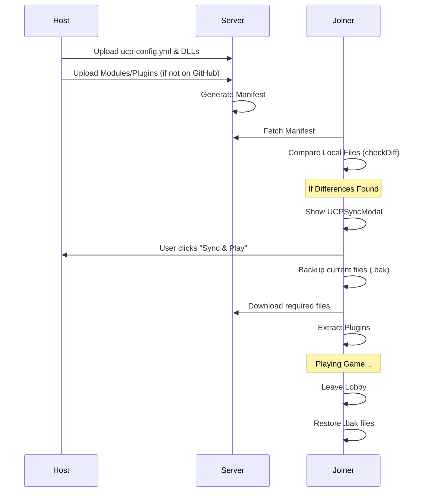

# UCP Mod Sync Process Technical Documentation

This document explains how the Stronghold Lobby application synchronizes UCP (Unofficial Crusader Patch) configurations and files between the host and joiners.

## Overview

The synchronization ensures all players in a lobby use the exact same mod setup, including modules, plugins, and core DLLs. The process involves:
1. **Host Upload**: The host uploads their local mod manifest and files to the server.
2. **Joiner Comparison**: When a joiner enters the lobby, their app compares their local files with the host's manifest.
3. **Backup & Download**: If differences are found, the joiner is prompted to download the required files, after their original files are backed up.
4. **Restoration**: When the joiner leaves the lobby, the original files are restored from backups.

## Sequence Diagram

## Key Components

### 1. Data Structures (`src/utils/ucp.ts`)
- `UCPConfig`: Represents the structure of `ucp-config.yml`.
- `FileDiff`: Represents a mismatch between local and server files.
  - `missing`: File exists on server but not locally.
  - `size_mismatch`: File size differs from server (indicates different content).
  - `version_mismatch`: Specifically for `ucp-config.yml` parsed content.

### 2. Detection Flow (`src/utils/ucp.ts#checkDiff`)
The `checkDiff` function performs the following steps:
1. Fetches the host's manifest from `/api/lobby/:id/manifest`.
2. Downloads the host's `ucp-config.yml` to memory and compares its `load-order` with the local one.
3. Checks for each file in the manifest:
   - **DLLs**: Located in the game root.
   - **Modules**: Located in `ucp/modules`.
   - **Plugins**: Located in `ucp/plugins`. If the folder exists, it currently assumes it's correct (improvement planned).

### 3. File Operations (`electron/ucp.ts`)
- `ucp-backup-file`: Renames `file.ext` to `file.ext.bak`.
- `ucp-restore-file`: Renames `file.ext.bak` back to `file.ext`.
- `ucp-unzip`: Extracts downloaded plugin ZIPs into the appropriate plugin folder.

### 4. Downloader (`electron/downloader.ts`)
Downloads files from the lobby server or GitHub.
- **Bug Fix**: Ensures files are saved to the absolute path provided (the game directory) rather than the default Downloads folder.

### 5. Frontend Trigger (`src/pages/LobbyRoom.tsx`)
- The `UCPSyncModal` is triggered when `performSyncCheck()` identifies diffs.
- This check runs on join and when the host sends a `ucp:updated` event through WebSockets.

## File References
- [LobbyRoom.tsx](file:///c:/Users/Jared/Documents/coding/stronghold-lobby/src/pages/LobbyRoom.tsx): UI Orchestration and Modal management.
- [ucp.ts (Utils)](file:///c:/Users/Jared/Documents/coding/stronghold-lobby/src/utils/ucp.ts): Core logic for diffing and download coordination.
- [ucp.ts (Electron)](file:///c:/Users/Jared/Documents/coding/stronghold-lobby/electron/ucp.ts): Low-level file system operations (backup, restore, unzip).
- [downloader.ts](file:///c:/Users/Jared/Documents/coding/stronghold-lobby/electron/downloader.ts): File download implementation using Node streams.
